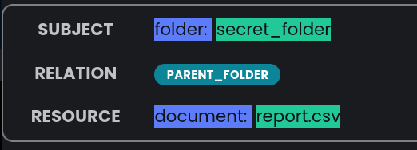
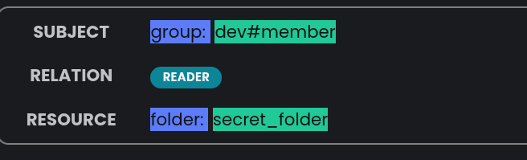
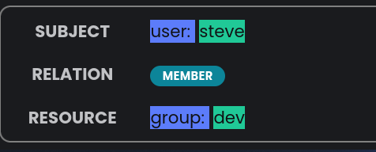
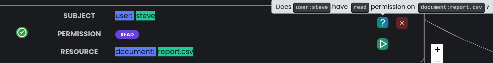
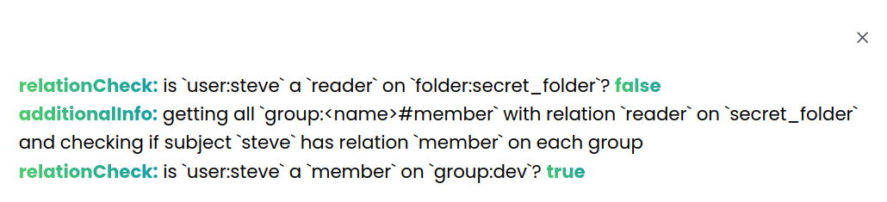

# https://kala.andreisurugiu.com/

Not a final version.


An authorization framework written in go based on [Zanzibar: Google’s Consistent, Global Authorization System](https://storage.googleapis.com/pub-tools-public-publication-data/pdf/10683a8987dbf0c6d4edcafb9b4f05cc9de5974a.pdf).

It offers an IDE with a graph for visualizing the relations and permissions between entities.

**!!! This is not meant for production usage, there are still a lot of things missing and the quality and organization of code is questionable since this is my first Go project and was done in a serious hurry!!!**  
See below for "planned" things.


## Editor

In the editor, you can define the relation between entities using `yaml`, for example, the default configuration is this:

```yaml
type: user
---
type: group
relations:
  member: user

---
type: folder
relations:
  reader: user | group#member

---
type: document
relations:
  parent_folder: folder
  writer: user
  reader: user
permissions:
  read: reader | writer | parent_folder.reader
  read_and_write: reader & writer
  read_only: reader & !writer
```

This is just an example, Kala is able to model and combine every type of authorization (**RBAC, ABAC, ACL, Custom Roles etc.**), you can find some examples in the dropdown.

In the above example, there are 4 types defined:

- **user**
- **group** that has a **relation** that indicates a `member` can be an **user**
- **folder** with a `reader` relation that can _either_ be an **user** or **the members of a group**
- **document** with some relations and some permissions:
  - `read` permission indicates that someone can **read** the document if they're a `reader` **OR** `writer` **OR** they have `reader` on the `parent_folder`
  - `read_and_write` indicates that they need to be both a `reader` **AND** a `writer`
  - `read_only` indicates that they need to be `reader` **BUT NOT** a `writer`

Permissions are only computed from relations.

After each change in the editor **you need to press `Ctrl+K` to load the config**.

## Tuples

You can define some tuples for the authorization system, as seen in the tuples tab which indicate the **relations** between some entities, the id of the entities is up to you to define, they don't have any more meaning than what you give them.

An interesting tuple is the following:


The `folder:secret_folder` is a `parent_folder` for `document:report.csv`.



The `member`s of `group:dev` are a `reader` on `folder:secret_folder`.



`user:steve` is a `member` of `group:dev`.

## PermissionCheck

You can verify permissions between entities, based on the previous example, does `user:steve` have `read` permission on `document:report.csv`?



Based on the defined relations, the answer is `true`.

## How does it work?

Kala uses `ent` as an ORM for the Go backend, which offers functions to query your database using a graph-like structure.

Internally, permissions are evaluated **concurrently** and short-circuited, for the example above, we're checking at the same time if steve has any of the following relations on the document: `reader | writer | parent_folder.reader`.

If any of them returns true, return `true` and cancel all other goroutines (since we have an **OR** expression).

This can be seen by clickiing the question mark button to get a little overview on the relation check process:



# Dev

In `./website`, create an `.env.local` with:

```
NEXT_PUBLIC_BACKEND_URL="http://127.0.0.1:1323/v0"
```

You can either build the docker image for the backend or run the backend using [task](https://taskfile.dev/).

```sh
task gen
task run-once
cd website
yarn dev
```

# How to use

The whole website is keyboard driven, press `Ctrl+Shift+K` for help

1. After you finish modifying your config, you need to reload the changes by pressing `Ctrl+K`
2. Add tuples to the database using the "Tuples" tab
3. Verify permissions using the "PermissionCheck" tab

# Future things?

- obviously implement a proper CRUD interface, don't @ me
- organize the code !!!
- caching for permission checks, implement something similar to Zookies used in Google's Zanzibar paper
- some proper logging
- healtcheck, metrics endpoints
- support relation checking
- watch permission changes endpoint
- answering the question: "Who has access to this resource?"
- Adding a way to add "public access" easily
- Proper expression support in permissions (doesn't support paranthesis)
- make it distributed
- some CLI functionality
- some simple policy engine similar to OPA on top
- SDKs and client libraries
