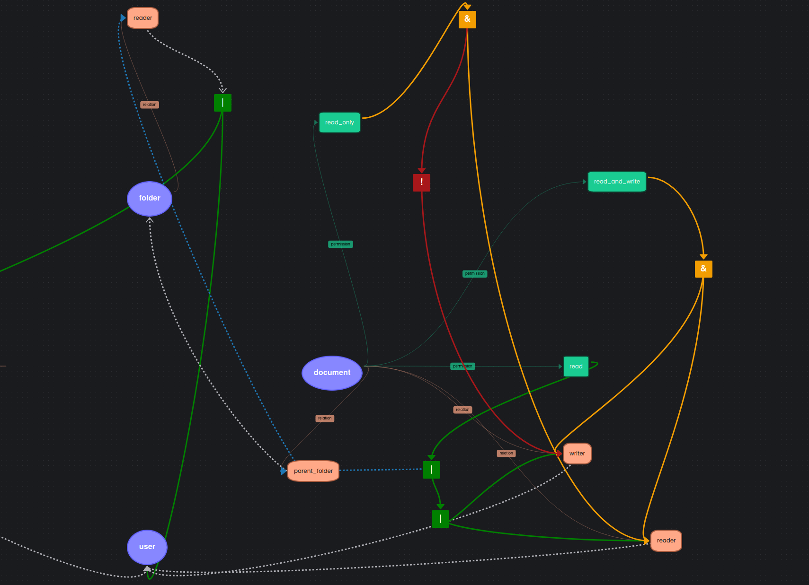

# kala

An authorization and policy engine written in go.



# TODO

- separate in modules
- run every operation in a transaction
- add some logging and replace instances of fmt.Println
- add expression parsing: paranthesis support, http calls
  - Parser supports paranthesis by default
  - `tr, _ := parser.ParseExpr("(reader | writer) & !parent_folder.reader")`
  - add binary expr type in ent
  - convert to breadth first search

```
[00] operation: &
[00] operation: |
[00] check relation: reader
[00] check relation: writer
[00] negation: !
[00] composed relation: parent_folder.reader
```

# Example of config

```yaml
type: user
---
type: group
relations:
  member: user

---
type: folder
relations:
  reader: user | group#member

---
type: document
relations:
  parent_folder: folder
  writer: user
  reader: user
permissions:
  read: reader | writer | parent_folder.reader
  read_and_write: reader & writer
  read_only: reader & !writer
```

```
document:report.csv #reader @user:anna
document:report.csv #writer @user:anna
folder:secret_folder #parent_folder @document:report.csv
folder:secret_folder #reader @user:john

group:dev #member @user:steve
folder:secret_folder #reader @group:dev#member
folder:secret_folder #reader @group:test_group#member
```

## Relation answering

1. Is `user:john` a `reader` on `folder:secret_folder`

## Permission answering

1. Does `user:anna` have `read` permission on `document:report.csv`?
2. Does `user:john` have `read` permission on `document:report.csv`?
3. Does `user:anna` have `read_only` permission on `document:report.csv`?
4. Does `user:steve` have `read` permission on `document:report.csv`?

- List everyone with `read` permission on `document:report.csv`
- List everyone with `read_only` permission on `document:report.csv`
