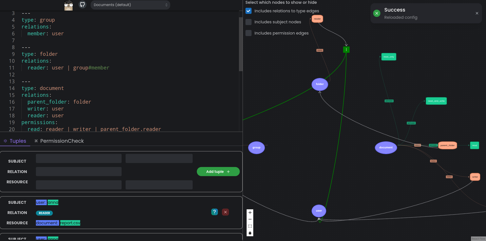

# https://kala.andreisurugiu.com/


An authorization and policy engine written in go.



# DEV

In `./website`, create an `.env.local` with:

```
NEXT_PUBLIC_BACKEND_URL="http://127.0.0.1:1323/v0"
```

# Example of config

```yaml
type: user
---
type: group
relations:
  member: user

---
type: folder
relations:
  reader: user | group#member

---
type: document
relations:
  parent_folder: folder
  writer: user
  reader: user
permissions:
  read: reader | writer | parent_folder.reader
  read_and_write: reader & writer
  read_only: reader & !writer
```

```js
document:report.csv #reader @user:anna
document:report.csv #writer @user:anna

folder:secret_folder #parent_folder @document:report.csv
folder:secret_folder #reader @user:john

group:dev #member @user:steve

folder:secret_folder #reader @group:dev#member

folder:secret_folder #reader @group:test_group#member
```

# How to use

The whole website is CLI driven, press `Ctrl+Shift+K` for help

1. After you finish modifying your config, you need to reload the changes by pressing `Ctrl+K`
2. Add tuples to the database using the "Tuples" tab
3. Verify permissions using the "PermissionCheck" tab
